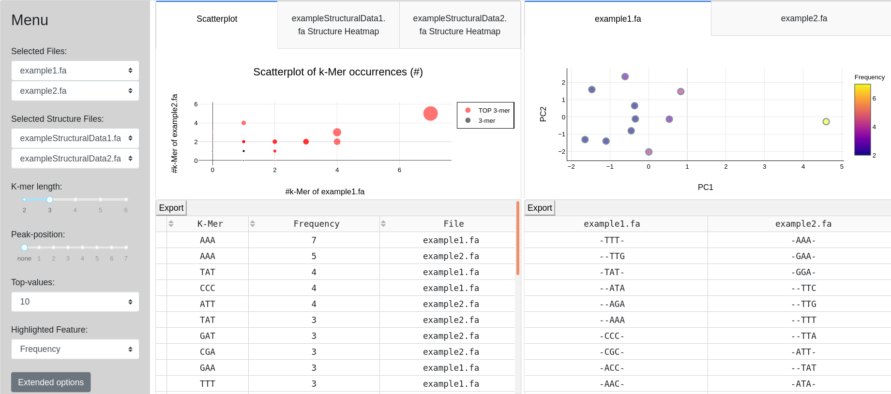
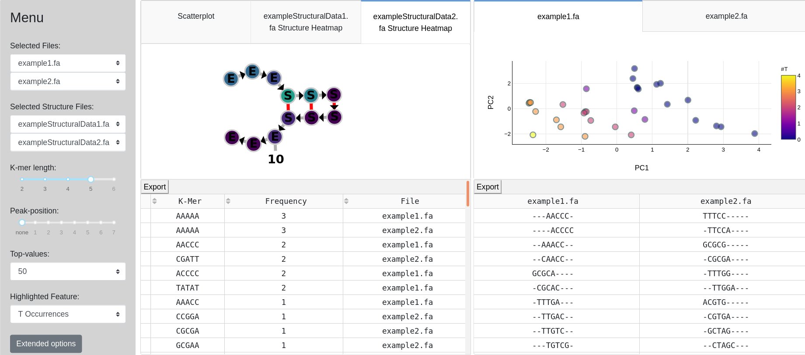

# k-mer-Dash 

## Intro

This tool harnesses the interactive Python framework Dash to allow users analyzing their sequence-based data.
Interactive plots and widgets are utilized to filter the data and discover sequence patterns.
A web-based Dash application will be initialized to share the data with collegues over the web browser.


## Getting Started
To use the app follow these instructions:

### Cloning / Downloading the source code
Cloning the source code to your local directory:

```
git clone https://github.com/lehecht/k-mer-Dash.git
```

Or downloading the source code from:
[https://github.com/lehecht/k-mer-Dash](https://github.com/lehecht/k-mer-Dash)

### Requirements
**k-mer Dash** runs with python 3.6. It is recommended to use a virtual environment.

#### Dependencies
The app makes use of external python-libraries, which need to be installed.
Setting up libraries, use:

```
pip3 install -r requirements.txt
```

Additionally **ClustalW** needs to be installed.

A system wide installation can be accomplished by (debian and ubuntu):
```
sudo apt install clustalw
```
Or by downloading from: [http://www.clustal.org/clustal2/](http://www.clustal.org/clustal2/) 
 
## Input
| parameter | Description |
|-------|---------------------------------------------|
| -fs FILES | List of FASTA formatted files with DNA nucleotide-sequences of equal length|
| -f FILE | Single FASTA formatted file with DNA nucleotide-sequences|
| -d DIR | Directory of FASTA formatted files with DNA nucleotide-sequences of equal length|
| -sfs FILES | List of FASTA formatted file with element-strings of equal length|
| -sf FILE | Single FASTA formatted file with element-strings|
| -sd DIR | Directory of FASTA formatted files with element-strings of equal length|
| -k INT | Length of generated k-mer (substrings) |
| -p INT | Highlighted position in sequence, e.g. center of a binding site |
| -t INT | Number of highest k-mer occurrences used for visualization |
| -c STR | Boolean starting program with GUI or on command-line |
| -pt INT | Custom port (only for GUI) |

## Output
On valid input parameters a Dash application is started to explore various k-mer visualizations and statistics.
It visualizes data as diagrams (Scatterplot, PCA, RNA Secondary Structure) and tables (k-mer Frequency-table, Alignment-table).

## Description

### Command-line
In order to use the application via command-line only requires to set 'console' parameter `-c` on `True`.
Mandatory parameters are `-f` and `-k`. All other parameters are optional. 
For commandline-mode only one single file can be evaluated.

#### Example:

The git project contains failsafe examples of generated fasta file in the *example* folder. An invokation to display the data on the console is listed below:

```
python3 main.py -f example/example1.fa -k 4 -t 5 -c True
```

#### Console Output:
```
Alignment of Top-kmere created with ClustalW
(for more information, see: http://www.clustal.org/clustal2/)

File: example1.fa
-TATA-
ATAT--
--AAAA
ACCC--
-CCCC-
AACC--


Options:
k: 4, peak: None, top: 5, files: ['example/example1.fa']

k-Mer		Frequency	File
AAAA		4		example1.fa
AACC		2		example1.fa
ACCC		2		example1.fa
CCCC		2		example1.fa
TATA		2		example1.fa
ATAT		2		example1.fa
```
### Graphical-User-Interface Output:
Starting the application with the interactive user interface requires no parameter except for at least two FASTA-Files (-fs or -d).
Port number (-pt) and structural data (-sd, -sfs, -sf) are optional. 

#### Example:
```
python3 main.py -d example/ -sd example/exampleStrucData
```

#### Output:




#### Plots
PCA: Principle component analysis of selected files

Scatterplot: k-mer frequencies of selected files are visualized as point in coordinate system

RNA-Structure Heatmap:
Arbitrary RNA-Structure based on alphabet of element-string. For example if alphabet contains no "i" or "I" (internal-loops), no internal-loops are visualized.
For heatmap highlighting k-mer frequency is used.
With 'extended options' normalization of number of occurrences can be normalized.
#### Settings
**Menu:**
* '_Select-Files_'-Dropdown: Select two files of given list of files, for which analysis should be done

* Slider/Dropdown: Set values for their property

* '_Highlighted-Feature_'-Dropdown: Change coloring in PCA plots from k-mer-frequency ('Frequency') to frequency of specific nucleotide (#T, #A, #C or #G) in k-mer

* '_Extended Options_'-Button: Change options for RNA structure visualization
#### Features

Tables:

* _Export_-Button: Export tables to csv-file

* Frequency-Table-Sorting: Sort by k-mers, frequency or filename

Plots:

* Dash-Features: Image-download, Zooming, Scaling, etc...

Tabs: Change view between files for PCA/RNA-Structure or scatterplot

## License
MIT

## Refrences
**ClustalW**: Julie D. Thompson, Desmond G. Higgins, Toby J. Gibson, CLUSTAL W: improving the sensitivity of progressive multiple sequence alignment through sequence weighting, position-specific gap penalties and weight matrix choice, Nucleic Acids Research, Volume 22, Issue 22, 11 November 1994, Pages 4673–4680, https://doi.org/10.1093/nar/22.22.4673

